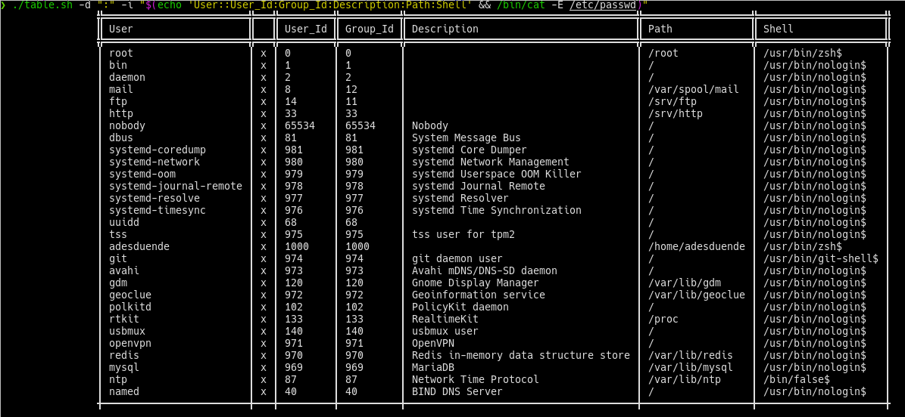

# bashTable

This is a script to print data in a table, you can change the delimiter of columns or the chars of the lines.
Inclusive is possible to change the color of the lines or data. Both in header or data table.

## Example usage

In this example, pass the data as a variable, is neccesary that every row are in a new line and the delimiter of colum if not present, is the standar char "_"
Presume that the data contains a string with this conditions.
```bash
.\table.sh $data
```

This is an example of data input.
```bash
export data=$'Title 1_Title 2_Title 3_Title 4_Title 5\n
A1_A2_A3_A4_A5\n
B1_B2_B3_B4_A5\n
C1_C2_C3_C4_C5\n
D1_D2_D3_D4_D5\n
E1_E2_E3_E4_E5\n
F1_F2_F3_F4_F5\n
G1_G2_G3_G4_G5\n'
```
## Options
 If you want to change column separator or other thing. Are some options available to do that.
 - **h**:   Show the help panel
 - **d**:   Delimiter column char. ex: -d "|"
 - **l**:   Change the chars of the lines of data "horizontal vertical corner" ex: -l "- | +"[^2]
 - **t**:   Change the chars of the lines of header "horizontal vertical corner" ex: -t "═ ║ ╬"
 - **c**:   Change the color[^1]. If use this option is necessary write the four color "title title_lines data data_lines" ex: -c "Blue NC NC NC"
 - **v**:   Show version of the script
 - **i**:   Display info about number of cols an rows
 - **n**:   Hide header, with this option, the first row don't show as header

```bash
./table.sh -l "% $ %" -t "@ # ¬" -c "Red Blue Green Yellow" $data
```

## Screenshot




[^1]: **Colors** "Black Red Green Orange Blue Purple Cyan Light_Gray Dark_Gray Light_Red Light_Green Yellow Light_Blue Light_Purple Light_Cyan White"
[^2]: **Some Chars** ▓ ▒ ░ │ ┤ ╣ ║ ╝ ╗ └ ┴ ┬ ├ ─ ┼ ╚ ╔ ╩ ╦ ╠ ═ ╬ █ ▄ ¦ ▀ ■